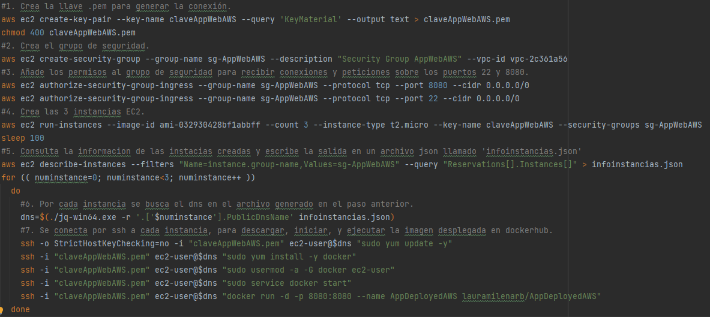

# TALLER APP WEB DESPLEGADA AUTOMATICAMENTE EN AWS

### Requerimientos previos
1. Instalar docker.
2. Instalar Git.
3. Instalar mvn.
4. Instalar AWS-Cli.

### Componentes de la aplicación
#### Front y Appi Rest
En el repositorio se ecuentra el front y el Api REST que corre con Java Y Spring Boot.
```
puerto: 80
```
### Configuracion incial
1. Clonar este repositorio con git mediante el siguiente comando:
    ```
    git clone https://github.com/LauraMilenaRB/AppAutomaticallyDeployedAWS.git
    ```
2. Desde la raiz **AppAutomaticallyDeployedAWS** ejecutar el archivo docker-compose.yml con el siguiente comando:
   ```
   docker-compose up -d 
   ```
3. Compruebe de manera local que se este ejecutando de manera correcta.


   1. Luego despliegue la imagen en dockerhub con el usuario personal. En este caso con lauramilenarb/AppDeployedAWS
       ```
       docker tag _AppDeployedAWS:latest lauramilenarb/AppDeployedAWS:latest
       docker push lauramilenarb/AppDeployedAWS:latest
       ```
### Desplegando instancias automaticas en AWS
   1. Primero se configura AWS-Cli. 

      Para crear una nueva configuración ejecute el siguiente comando:
      ```
      aws configure
      ```
      Luego cambie los valores corrrespondientes en *'{...}'* deacuerdo a sus configuraciones y preferencias:
      ```
      AWS Access Key ID [None]: {accesskey}
      AWS Secret Access Key [None]: {secretkey}
      Default region name [None]: {us-west-2}
      Default output format [None]:
      ```
   2. Luego se ejecuta el *'ScriptDespliegueAtomaticoAWS.sh'* para correrlo con la consola bash, que realiza las siguientes acciones:
   

   3. Por ultimo se verifique  que las instancias se esten ejecutando de manera correcta.

